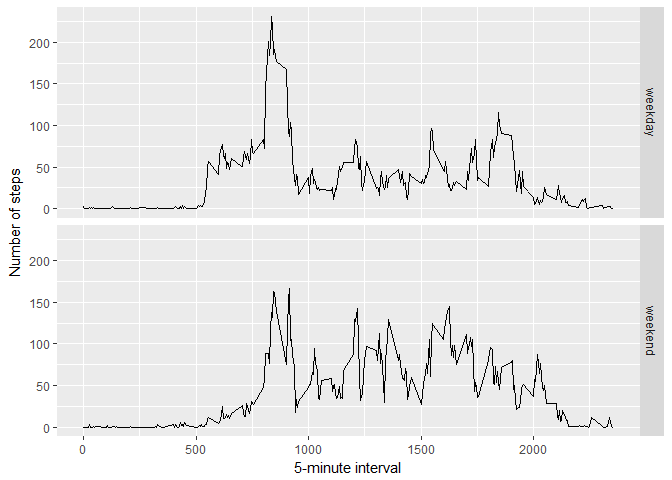

# Reproducible Research: Peer Assessment 1

```r
library(ggplot2)
```

## Loading and preprocessing the data

```r
activityM<-read.csv("activity.csv")
```

## What is mean total number of steps taken per day?
1 - Making the histogram

```r
stepsPerDay<-tapply(activityM$steps,activityM$date,sum,na.remove=T)

ggplot(NULL, aes(x=stepsPerDay,fill=..count..))+geom_histogram(binwidth=1000,na.rm=T)+
    xlab("Total number of steps taken each day")
```

<!-- -->

2 - Calculating the mean and median of steps per day

```r
stepsPerDayMedian<-median(stepsPerDay,na.rm=T)
```

```
## [1] 10766
```

```r
stepsPerDayMean<-mean(stepsPerDay,na.rm=T)
```

```
## [1] 10767.19
```

## What is the average daily activity pattern?
Make a time series plot (i.e. type = "l") of the 5-minute interval (x-axis) and the average number of steps taken, averaged across all days (y-axis)

```r
averages <- aggregate(x=list(steps=activityM$steps), by=list(interval=activityM$interval),
                      FUN=mean, na.rm=TRUE)

ggplot(data=averages,aes(x=interval,y=steps))+geom_line()+xlab("5 min intevall key")+ylab("Mean of steps taken")
```

<!-- -->

Which 5-minute interval, on average across all the days in the dataset, contains the maximum number of steps?

```r
averages[which.max(averages$steps),]
```

```
##     interval    steps
## 104      835 206.1698
```

## Imputing missing values
There are many days/intervals where there are missing values (coded as NA). The presence of missing days may introduce bias into some calculations or summaries of the data.

```r
NAs<-is.na(activityM$steps)
sum(NAs)
```

```
## [1] 2304
```

Devising a strategy for filling in all of the missing values in the dataset, by replacing the NA with the interval's mean.

```r
fixing <- function(steps, interval) {
    fixed <- NA
    if (!is.na(steps))
        fixed <- c(steps)
    else
        fixed <- (averages[averages$interval==interval, "steps"])
    return(fixed)
}
```

Create a new dataset that is equal to the original dataset but with the missing data filled in.

```r
cleanedCsv <- activityM
cleanedCsv$steps <- mapply(fixing, cleanedCsv$steps, cleanedCsv$interval)
```

Make a histogram of the total number of steps taken each day and Calculate and report the mean and median total number of steps taken per day.

```r
totalSteps <- tapply(cleanedCsv$steps, cleanedCsv$date, FUN=sum)
qplot(totalSteps, binwidth=1000, xlab="Total number of steps taken each day")
```

<!-- -->

```r
median(totalSteps)
```

```
## [1] 10766.19
```

```r
mean(totalSteps)
```

```
## [1] 10766.19
```
Mean and median values are higher after imputing missing data. The reason is that in the original data, there are some days with steps values NA for any interval.

## Are there differences in activity patterns between weekdays and weekends?
Create a new factor variable in the dataset with two levels -- "weekday" and "weekend" indicating whether a given date is a weekday or weekend day.

```r
library(lubridate)
```

```
## 
## Attaching package: 'lubridate'
```

```
## The following object is masked from 'package:base':
## 
##     date
```

```r
checker<-function(x){
    day<-wday(x)
    if(1<day & day<7){
        return("weekday")
    }
    if(day == 1 | day==7){
        return("weekend")
    }
    else{
        return("invalid date")
    }
}
cleanedCsv$date<-as.Date(cleanedCsv$date)
cleanedCsv$date<-sapply(cleanedCsv$date,FUN=checker)
```

Now, let's make a panel plot containing plots of average number of steps taken on weekdays and weekends.


```r
averages <- aggregate(steps ~ interval + date, data=cleanedCsv, mean)
ggplot(averages, aes(interval, steps)) + geom_line() + facet_grid(date ~ .) +
    xlab("5-minute interval") + ylab("Number of steps")
```

<!-- -->
